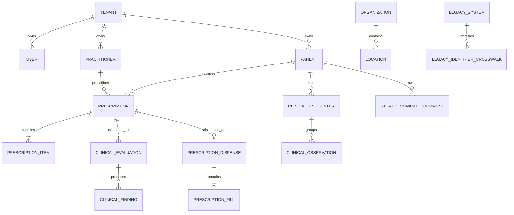

# DawaTrace Data Model

## Aggregate Roots

- Tenant: owner of every non-global business record.
- User: local authentication principal; roles and ABAC policies authorize work.
- Patient: canonical healthcare subject and identifier owner.
- Practitioner: canonical professional with licences and organization roles.
- Prescription: patient/prescriber/location aggregate and workflow state.
- ClinicalKnowledgeRelease: source/licence/version boundary for CDS rules.
- FHIRTerminologyVersion: source/licence/version boundary for terminology.

## Key Relationships

## Integrity Rules

UUID primary keys are generated independently. Composite unique constraints
include tenant for patient references, prescription numbers, idempotency keys,
roles, provider queues, and crosswalk source identities. Related healthcare rows
run same-tenant validation. Explicitly global medicine/CDS/terminology rows use
scope checks and are read only through global-aware managers/services.

The schema has no target foreign key in a legacy crosswalk. `target_uuid` remains
a plain UUID so future migration can reconcile missing targets without coupling
to a source or a polymorphic database relation.
