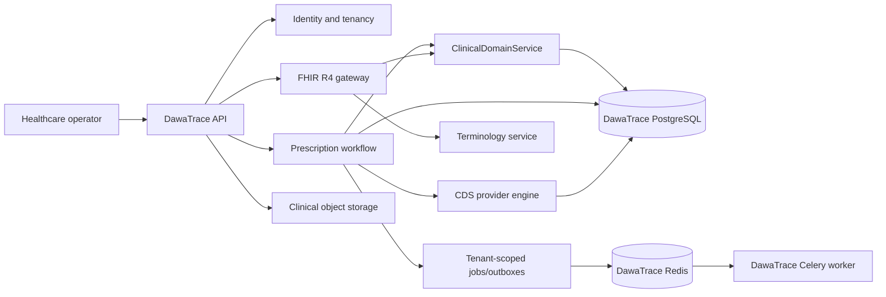

# DawaTrace System Architecture

## Phase 2 Shape

DawaTrace is an independent Django modular monolith. It owns its PostgreSQL
database, Redis namespace, Celery workers, clinical object storage, API boundary,
and release lifecycle. It does not import code or query tables from Mercato-OS.

## Runtime Components

- API: Django 5.1/DRF, Gunicorn, OpenAPI, health and administrative shell.
- Database: PostgreSQL 18 in Compose; SQLite is test-only evidence storage.
- Cache/jobs: Redis 7, Celery worker, and optional beat process.
- Documents: local tenant-keyed implementation behind a storage abstraction;
  external object storage is a later adapter.
- FHIR: HL7 FHIR R4 4.0.1 boundary locked to `fhir.resources==6.5.0` and
  `pydantic==1.10.26`.

## Trust Boundaries

HTTP identity, tenant context, provider adapters, clinical knowledge providers,
and object downloads are explicit boundaries. Missing tenant, clinical knowledge,
authorization, provider configuration, or document integrity fails closed.

## Deliberate Non-Scope

Inventory, procurement, supplier management, finance, payment gateways, Windows/
Android POS, complete HQ UI, controlled-drug operations, and production migration
are not part of Phase 2.
