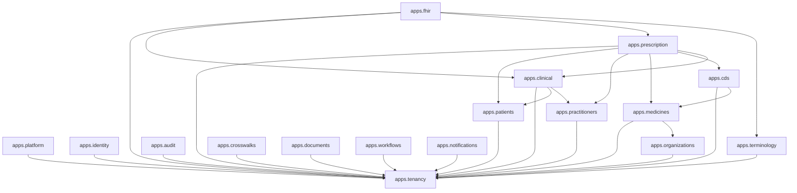
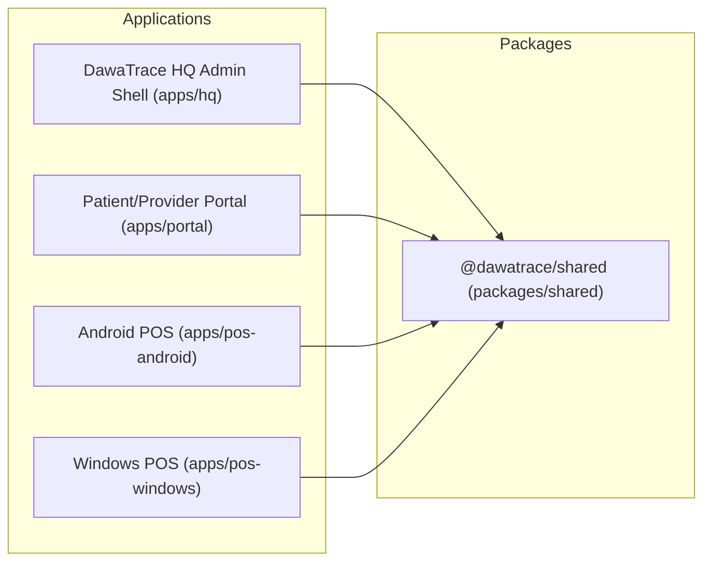

# DawaTrace Repository Architecture & Dependency Graph

## Executive Overview

DawaTrace is Esenai Group Ltd's standalone enterprise pharmacy platform and intelligent clinical point-of-sale (POS) system. It is designed as a strict, tenant-isolated modular monolith.

This document establishes the authoritative application dependency graph, domain boundaries, single sources of truth, state machines, and contract mapping rules across the repository.

---

## 1. Backend Application Dependency Graph (`backend/apps/`)



### Module Responsibilities & Boundary Invariants

1. **`apps.tenancy` / `apps.identity` / `apps.organizations`**:
   - Authoritative for tenant resolution, identity federation, user roles, and organization structures.
   - Every domain query is tenant-qualified via `StrictTenantManager`.

2. **`apps.clinical` & `apps.patients` / `apps.practitioners`**:
   - Centralized boundary for clinical data integrity.
   - Enforces same-tenant/same-patient invariants, immutable ownership, document hashes, and temporal consistency.

3. **`apps.prescription` & `apps.cds`**:
   - Owns the canonical prescription lifecycle and drug interaction checking.
   - Prescriptions cannot bypass clinical review or interaction evaluation.

4. **`apps.fhir` & `apps.terminology`**:
   - HL7 FHIR R4 4.0.1 gateway mapping domain models to/from FHIR resource representations.
   - Terminology service managing code systems, value sets, and concept validations.

5. **`apps.crosswalks` & `apps.documents`**:
   - Legacy system identifier mapping and document encryption/storage.

---

## 2. Shared Packages & Frontend Workspaces



* **`@dawatrace/shared`**: The single source of truth for TypeScript interfaces, API contract definitions, FHIR types, and domain status enums.
* **Frontend Applications**: Consume `@dawatrace/shared` contracts directly. No ad-hoc or duplicated type definitions are permitted.

---

## 3. Authoritative State Machine Specifications

### Prescription Lifecycle State Machine (`apps.prescription`)

```text
DRAFT -> CLINICAL_REVIEW -> APPROVED / BLOCKED -> DISPENSING
      -> READY_FOR_PAYMENT -> PAID -> DISPENSED -> REVERSED
```

- **Invariant**: State transitions must be executed through `PrescriptionWorkflowService`. Direct database status mutation is strictly prohibited.
- **Payment & Dispensing Separation**: Payment completion (`PAID`) and physical dispensing completion (`DISPENSED`) remain separate, auditable domain states.

---

## 4. Architectural Rules & Governance

1. **No Live External Dependencies**: DawaTrace must remain completely runnable without Mercato-OS databases, APIs, or queues.
2. **Contract-First Changes**: Model or serializer changes must simultaneously update backend serializers, tests, shared TS interfaces (`packages/shared`), and API clients.
3. **Append-Only Clinical Audit**: All clinical reviews, CDS overrides, and status transitions generate immutable, actor-attributed audit records.
