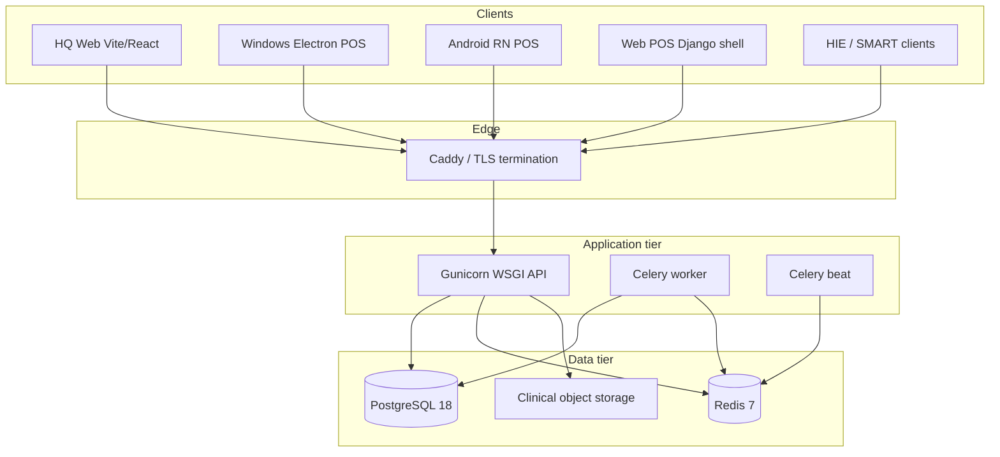

# TibaTrace / DawaTrace — Technical System Documentation

**Document type:** Living engineering reference  
**Audience:** Architects, security reviewers, integrators, auditors, senior engineers  
**Last updated:** 2026-07-31  
**Product brand:** TibaTrace (customer-facing)  
**Internal namespace:** DawaTrace (repo, packages, env vars, API, FHIR)  
**Vendor:** Esenai Group Ltd  

This document describes the **as-built** system: runtime stack, UI/UX surfaces,
database, security, encryption, customer/patient data handling, and compliance
posture. It supersedes high-level Phase-2 scope notes where the codebase has
grown beyond them.

---

## Table of contents

1. [Executive technical summary](#1-executive-technical-summary)
2. [Repository & monorepo layout](#2-repository--monorepo-layout)
3. [Runtime architecture](#3-runtime-architecture)
4. [Framework & dependency inventory](#4-framework--dependency-inventory)
5. [UI / UX surfaces](#5-ui--ux-surfaces)
6. [Backend domain map (Django apps)](#6-backend-domain-map-django-apps)
7. [Database architecture](#7-database-architecture)
8. [Caching, sessions, async jobs](#8-caching-sessions-async-jobs)
9. [Identity, authentication & authorization](#9-identity-authentication--authorization)
10. [Multi-tenancy](#10-multi-tenancy)
11. [Customer & patient data handling](#11-customer--patient-data-handling)
12. [Security architecture](#12-security-architecture)
13. [Encryption & cryptographic controls](#13-encryption--cryptographic-controls)
14. [Payments & financial data](#14-payments--financial-data)
15. [FHIR / Kenya HIE interoperability](#15-fhir--kenya-hie-interoperability)
16. [Compliance register](#16-compliance-register)
17. [Observability, audit & integrity](#17-observability-audit--integrity)
18. [Deployment & CI/CD](#18-deployment--cicd)
19. [Known gaps & non-claims](#19-known-gaps--non-claims)
20. [Related documents](#20-related-documents)

---

## 1. Executive technical summary

TibaTrace is a **multi-tenant pharmacy and healthcare operations platform**
implemented as a **Django modular monolith** with:

| Layer | Technology |
|-------|------------|
| API / domain | Python 3.11, Django 5.1.15, Django REST Framework 3.15.2 |
| Primary DB | PostgreSQL 18 (production/compose); SQLite for local default / tests |
| Cache / jobs | Redis 7, Celery 5.4 |
| HQ UI | Vite 8 + React 19 + TypeScript (custom CSS, no MUI/Tailwind) |
| POS web | Django templates + vanilla JS |
| POS Windows | Electron 43 + React 19 |
| POS Android | React Native 0.86 |
| Shared contracts | `@dawatrace/shared` (TypeScript) |
| Clinical exchange | HL7 FHIR R4 `4.0.1` (`fhir.resources==6.5.0`) |
| Auth | SimpleJWT (Bearer) + Django session cookies (HQ/POS web) |
| Isolation | Shared-schema, row-level tenancy (`StrictTenantManager` + middleware) |

Trust model: **fail closed** on missing tenant, failed CDS knowledge, unsigned
documents, unconfigured payment adapters, and unauthorized FHIR absolute
references.

---

## 2. Repository & monorepo layout

```
D:\DHA\
├── backend/                 # Django project (dawatrace)
│   ├── apps/                # Domain apps (modular monolith)
│   ├── dawatrace/           # settings, urls, wsgi, asgi, celery
│   ├── static/pos/          # Web POS assets
│   ├── templates/pos/       # Web POS shell
│   ├── requirements.lock    # Pinned production Python deps
│   └── requirements-dev.lock
├── apps/
│   ├── hq-web/              # Headquarters SPA (Vite/React)
│   ├── pos-windows/         # Electron POS
│   ├── pos-android/         # React Native POS
│   ├── hq/, portal/         # Placeholders
├── packages/shared/         # @dawatrace/shared TS contracts
├── docs/                    # Architecture, domain, FHIR, security
├── docker/                  # backend.Dockerfile
├── docker-compose.yml       # Local postgres/redis/api/worker/beat
├── deploy/tibatrace/        # Production Compose / Caddy
├── scripts/                 # Validation, FHIR validators, packaging
└── .github/workflows/       # CI, FHIR validation, releases
```

**Tooling**

| Tool | Role |
|------|------|
| npm workspaces | `apps/*`, `packages/*` (Node `>=22.13 <23`) |
| package-lock.json | JS lockfile (no pnpm / yarn / turbo) |
| pip + requirements.lock | Python deps (no Poetry) |
| pyproject.toml | Ruff / Bandit only |
| Django migrations | Schema evolution per app |

---

## 3. Runtime architecture



| Process | Entry | Role |
|---------|-------|------|
| API | `dawatrace.wsgi:application` via Gunicorn | HTTP APIs, admin, web POS, FHIR |
| ASGI | `dawatrace.asgi:application` | Declared; compose uses WSGI |
| Worker | Celery, queue `dawatrace-clinical` | Async clinical/notification jobs |
| Beat | Celery beat | Scheduled tasks |

**Local Compose ports:** Postgres `5433→5432`, Redis `6380→6379`, API `8000`.  
**Production target:** `https://tibatrace.esenai.co.ke/` (`deploy/tibatrace/`).

---

## 4. Framework & dependency inventory

### 4.1 Backend (locked)

| Package | Version | Purpose |
|---------|---------|---------|
| Django | 5.1.15 | ORM, admin, sessions, middleware |
| djangorestframework | 3.15.2 | REST API |
| djangorestframework-simplejwt | 5.5.1 | Access/refresh Bearer JWTs |
| django-filter | 24.3 | Query filtering |
| drf-spectacular | 0.27.2 | OpenAPI schema |
| psycopg[binary] | 3.2.3 | PostgreSQL driver |
| celery | 5.4.0 | Async task execution |
| redis / django-redis | 5.2.0 / 5.4.0 | Broker, cache |
| gunicorn | 23.0.0 | Production WSGI |
| whitenoise | 6.8.2 | Static file serving |
| django-cors-headers | 4.6.0 | CORS |
| cryptography | 48.0.1 | Fernet, hashes |
| fhir.resources | 6.5.0 | FHIR R4 models |
| pydantic | 1.10.26 | FHIR model dependency (locked) |
| boto3 / django-storages | 1.43.x / 1.14.6 | Optional S3 for POS releases |

Dev: pytest, pytest-django, ruff, bandit, pip-audit.

### 4.2 Frontend / native (resolved)

| Surface | Stack |
|---------|-------|
| HQ | React 19.2.8, Vite 8.1.5, TypeScript 5.7.3, Vitest |
| Windows POS | Electron 43.2.0, React 19, Vite, electron-builder / MSIX |
| Android POS | React Native 0.86.0, React 19 |
| Shared | `@dawatrace/shared` — auth, clinical, dispensing, retail, money, design tokens |

**Deliberate absences:** Next.js, MUI, Chakra, Tailwind, Bootstrap (except DRF Spectacular Swagger chrome).

### 4.3 Timezone & locale defaults

- Django `TIME_ZONE = Africa/Nairobi`
- FHIR / commercial currency convention: **`KES`**
- FHIR Content-Type: **`application/fhir+json`**

---

## 5. UI / UX surfaces

### 5.1 Headquarters Web (`apps/hq-web`)

| Aspect | Detail |
|--------|--------|
| Pattern | SPA; view-state navigation (**no** react-router) |
| Auth UX | Cookie session via `/api/identity/session/` (sign-in, forgot, reset) |
| Dev | Vite proxies `/api` → Django `:8000`; typically `http://127.0.0.1:5173/` |
| Design | Custom CSS variables; Inter; light/dark; workspace shells |
| Workspaces | overview, network, people, catalogue, inventory, procurement, commerce, pricing, cash, insurance, clinical, governance, access |

**UX principles in code:** role-capability gated nav; tenant context; operational dashboards rather than marketing surfaces.

### 5.2 Web POS (server-rendered)

| Aspect | Detail |
|--------|--------|
| Routes | `/`, `/pos/` → `platform.views.pos_terminal_view` |
| Template | `backend/templates/pos/pos.html` |
| Logic | `backend/static/pos/js/pos.js` — **vanilla JS** (`fetch`), not jQuery/HTMX |
| Style | `backend/static/pos/css/pos.css` — dark till theme; Inter + JetBrains Mono |
| Features | Dispensing queue, KPI drill-downs, CDS safety banners/overrides, payment gate, queue collapse |
| Auth | Django session + CSRF |

### 5.3 Windows POS (`apps/pos-windows`)

| Aspect | Detail |
|--------|--------|
| Shell | Electron 43 desktop |
| Auth | JWT; credentials protected with **Windows DPAPI** |
| Surfaces | Retail till, prescription/clinical review, pharmacist review, batch verify, payment, register/sync, print, counselling, final check, workflow ribbon |
| Packaging | MSIX / NSIS via electron-builder |
| Testing | Playwright visual regression |

### 5.4 Android POS (`apps/pos-android`)

| Aspect | Detail |
|--------|--------|
| Runtime | React Native 0.86 |
| Auth | Login ID + PIN → `PosCredential` / `PosSession`; keystore-backed tokens |
| Network | Cleartext blocked in release builds |
| Surfaces | Retail, dispensing, clinical review, payment, register/sync, print, counselling |
| Packaging | AAB / APK release scripts |

### 5.5 Shared design system (`packages/shared`)

Tokens, layout primitives, workflow glyphs, retail/clinical status, money
formatting (2 decimal places system-wide via `money.ts` / `apps.core.money`).

### 5.6 Operator roles (capability-driven, not fixed Django Groups)

| Persona | Typical capabilities |
|---------|----------------------|
| Cashier / till operator | POS shift, payment collect, limited patient fields |
| Pharmacist | `prescriptions.*`, verify/approve, controlled supply, CDS acknowledge |
| CDS secondary approver | `cds.override` (SoD — distinct credentials) |
| Inventory | `inventory.*`, receiving, stocktake |
| HQ manager / supervisor | pricing, procurement approve, network ops |
| Platform admin | capability `*`; cross-tenant ops |

Seed demos exist for HQ and POS (see test seeds / management commands).

---

## 6. Backend domain map (Django apps)

Mounted under `backend/apps/`; registered in `dawatrace.settings.base.INSTALLED_APPS`.

| App | Responsibility |
|-----|----------------|
| `core` | UUID models, tenant context/middleware, StrictTenant managers, DRF exception handler, money helpers, permissions |
| `platform` | Health/info, HQ overview APIs, admin shell, POS release metadata, client-version gate, web POS view |
| `tenancy` | `Tenant` lifecycle (`PROSPECT`→`ONBOARDING`→`ACTIVE`→`SUSPENDED`/`TERMINATED`) |
| `pharmacy_network` | Regulatory/pharmacy profile, licence admin |
| `identity` | Custom `User`, roles, capabilities, ABAC deny policies, service accounts, JWT + session APIs, POS credentials |
| `organizations` | Healthcare organizations & locations |
| `patients` | Canonical patients, encrypted identifiers, allergies, meds, clinical summaries |
| `practitioners` | Prescribers, licences, roles |
| `medicines` | Catalogue, dose forms, SKUs, manufacturers |
| `prescription` | Rx lifecycle, dispensing episodes, payment, labels, counselling, interventions |
| `clinical` | Encounters, conditions, observations, diagnostic reports, MAR, clinical documents |
| `cds` | Clinical decision support, POS screening, offline package signing, overrides |
| `inventory` | Locations, batches, FEFO, ledger, reservations, transfers, stocktake |
| `procurement` | Suppliers, POs, goods receipt |
| `pricing` | Versioned price books, overrides, applied-price snapshots |
| `pos_shift` | Register sessions, cash ledger, Z-closure |
| `pos_transactions` | Retail transaction state machine |
| `customers` | Commercial B2B/B2C customer master |
| `sales` | Quotations, sales orders, fulfilment pipeline |
| `insurance` | Schemes, members, preauth, claims, remittance adapters |
| `terminology` | FHIR CodeSystem / ValueSet store |
| `fhir` | FHIR R4 gateway, Kenya eRx/Claims IG, SMART, HIE conventions |
| `documents` | Encrypted/signed clinical object storage + access events |
| `audit` | Immutable `AuditEvent` log |
| `workflows` | Domain-event outbox |
| `notifications` | Notification outbox |
| `crosswalks` | Legacy ID → UUID migration maps |

API root: `backend/dawatrace/urls.py` (`/api/...`, `/api/fhir/r4/`, `/admin/`, `/pos/`).

---

## 7. Database architecture

### 7.1 Engines

| Environment | Engine | Notes |
|-------------|--------|-------|
| Compose / production | **PostgreSQL 18** (`postgres:18-alpine`) | Primary system of record |
| Local unset URL | SQLite file `backend/dawatrace.sqlite3` | Dev convenience |
| Tests | `sqlite:///:memory:` via `dawatrace.settings.test` | Fast isolation |

**No** TimescaleDB, PostGIS, or pgvector extensions in compose.

### 7.2 Connection configuration

| Variable | Purpose |
|----------|---------|
| `DAWATRACE_DATABASE_URL` | `postgresql://…` or `sqlite://…` |
| `DAWATRACE_DATABASE_SSLMODE` | Default `prefer`; production requires TLS-capable mode |

Production settings reject unsafe defaults and expect Postgres with SSL.

### 7.3 Schema strategy

- **Shared database, shared schema**, row-level tenancy via `tenant_id` FK on domain tables.
- Evolution: **Django migrations** per app (`apps/<name>/migrations/`).
- Compose API container runs `migrate` before Gunicorn.

### 7.4 Core relational patterns

```text
tenancy.Tenant 1──* identity.User
              1──* patients.Patient 1──* PatientIdentifier (encrypted)
              1──* prescription.Prescription 1──* PrescriptionItem
                                              └──* PrescriptionFill / Dispense
              1──* inventory.* (batches, balances, ledger)
              1──* insurance.* (claims, members)
              1──* audit.AuditEvent
              1──* documents.StoredClinicalDocument
```

Identifiers are UUID-oriented (`apps.core` base models). Cross-tenant FKs are
rejected by model validation and tenant-qualified querysets.

### 7.5 Important model clusters

**Patients:** demographics, `PatientIdentifier` (`protected_value`, `value_hash`,
`last_four`), allergies, medication history, clinical summary (pregnancy,
renal/hepatic indicators, etc.).

**Prescription / dispensing:** prescription + items, pharmacist verify/review,
dispensing episode + lines, allocations, labels, counselling, returns/reversals,
POS device/shift audits.

**Inventory:** locations, batches (expiry/FEFO), on-hand/reserved/available
balances with DB check constraints, reservations, transfers, stocktake.

**Insurance:** insurers, schemes, plans, members (masked membership in APIs),
preauthorization, claims adjudication, remittance inbox/outbox — currently
**proprietary REST**, not yet FHIR `Claim` resources on the gateway.

**Clinical:** `ClinicalEncounter`, conditions, observations, diagnostic reports,
medication administration records.

---

## 8. Caching, sessions, async jobs

| Concern | Implementation |
|---------|----------------|
| Cache | `django_redis` on `DAWATRACE_REDIS_URL` (default `redis://localhost:6380/0`); tests use `locmem://` |
| Celery broker | Redis DB `/1` |
| Celery results | Redis DB `/2` |
| Queue | `dawatrace-clinical` for `apps.*` tasks |
| HTTP sessions | **Database-backed** Django sessions (not Redis sessions) |
| Redis persistence | Compose Redis AOF enabled |

---

## 9. Identity, authentication & authorization

### 9.1 Authentication mechanisms

| Mechanism | Clients | Endpoints / notes |
|-----------|---------|-------------------|
| **SimpleJWT** | Windows/Android POS, API clients | `/api/identity/token/`, `/token/refresh/`; custom `DawaTraceTokenSerializer`; `Authorization: Bearer` |
| **Django session** | HQ web, web POS | `/api/identity/session/`; HttpOnly cookie; CSRF; sign-in throttle `10/min` |
| **POS Login ID + PIN** | Native POS | `PosCredential` / `PosSession` models |
| **SMART / AfyaLink** | HIE (planned) | Discovery at `/api/fhir/r4/.well-known/smart-configuration`; wire via `DAWATRACE_FHIR_SMART_*` / `DAWATRACE_FHIR_AFYALINK_TOKEN_URL` |
| **External IdP map** | Future OIDC | `ExternalIdentityMapping` (issuer/subject per tenant) |
| **Service accounts** | Machine-to-machine | `ServiceAccount` + capability lists |

Password reset: `/api/identity/password/forgot|reset/` (throttled).  
Default DRF permission: `IsAuthenticated`.

### 9.2 Authorization model (RBAC + ABAC)

1. **Roles** hold JSON lists of capability strings (e.g. `patients.read`,
   `prescriptions.pharmacist_verify`, `cds.override`, `pos.payment.collect`,
   `system/Patient.read`).
2. **`User.effective_capabilities` / `has_capability`** compute grants.
3. **`AttributePolicy` DENY** entries override grants (ABAC).
4. **Platform admin / superuser** → capability `*`.
5. DRF helpers: `TenantRequired`, `CapabilityRequired`, `TenantCapabilityPermission`
   (`apps.core.permissions`).
6. FHIR: `FHIRResourcePermission` maps resource interactions to registry
   capabilities.

### 9.3 Segregation of duties (clinical)

- CDS overrides require **secondary approver credentials** without replacing the
  till session (`cds.override`).
- Cashier cannot act as pharmacist on decide paths.
- Findings marked non-overridable cannot be overridden.
- Procurement SoD documented separately (`PROCUREMENT_SEGREGATION_OF_DUTIES.md`).

---

## 10. Multi-tenancy

**Pattern:** shared PostgreSQL schema; every domain row carries `tenant_id`.

| Control | Mechanism |
|---------|-----------|
| Request context | `TenantContextMiddleware` + `ContextVar` (`apps.core.tenant_context`) |
| Header | `X-Tenant-ID` (platform admins may switch; normal users locked to home tenant) |
| Querysets | `StrictTenantManager` — **empty result set** if no tenant in context (fail closed) |
| Bypass | `all_objects` manager — must still filter by tenant in services |
| Lifecycle | Non-`ACTIVE` tenants blocked (403) except platform ops |
| FHIR | All reads/searches/writes tenant-scoped; reference resolver tenant-qualified |

**Approved exception:** `identity.User` uses Django’s default manager so
authentication can occur before tenant middleware attaches context; subsequent
capability checks remain tenant-qualified.

---

## 11. Customer & patient data handling

### 11.1 Two “customer” concepts

| Concept | App | Data |
|---------|-----|------|
| **Patient** (clinical) | `patients` | PHI — demographics, identifiers, allergies, clinical summary |
| **Customer** (commercial) | `customers` | B2B/B2C trade accounts for sales/quotations |

Clinical PHI and commercial CRM are separate bounded contexts.

### 11.2 Patient identity protection

Implementation: `apps.patients.services.PatientIdentifierProtector`.

| Step | Algorithm |
|------|-----------|
| Normalize | Strip, upper-case, collapse whitespace |
| Encrypt at rest | **Fernet** (AES-128-CBC + HMAC) via `cryptography` |
| Fernet key derivation | `SHA256(f"{SECRET_KEY}:patient-identifier:{tenant_id}")` → urlsafe-b64 |
| Lookup digest | **HMAC-SHA256**(`key=f"{SECRET_KEY}:{tenant_id}"`, `msg=f"{type}:{normalized}"`) → `value_hash` |
| Storage | `protected_value` (ciphertext); plain `value` emptied when protected; `last_four` for UI |
| Display | `masked_value` → `••••` + last four |
| Reveal | Requires `patients.identity.view` **or** `patients.sensitive.view` **plus reason**; emits audit `PATIENT_IDENTIFIER_REVEALED` |

Serializers strip sensitive contact/address/emergency fields unless
`patients.sensitive.view` is held.

### 11.3 POS minimization

Documented in `docs/domain/POS_PATIENT_PRIVACY.md` and RBAC matrices:

- Cashiers see operationally necessary fields only.
- Pharmacists see clinical safety context for dispensing.
- Insurance membership numbers masked in API serializers.

### 11.4 Clinical documents

- Path keys: `tenant/<uuid>/clinical/<patient_id>/<sha256>/<filename>`
- Content-type allowlist + max bytes (`DAWATRACE_DOCUMENT_*`)
- SHA-256 integrity; production requires clean malware scan result
- Signed download tokens bind document, tenant, actor, age (`django.core.signing`, salt `dawatrace.document`)
- Every access → `DocumentAccessEvent`

### 11.5 Data subject / privacy operations

Engineering supports access minimization and audited reveal. Formal **DSAR**
workflows and ODPC registration are organizational controls (see compliance
gaps).

---

## 12. Security architecture

### 12.1 HTTP / transport

| Control | Dev default | Production |
|---------|-------------|------------|
| TLS redirect | Off (`SECURE_SSL_REDIRECT`) | On |
| HSTS | Off | 1 year + subdomains + preload |
| Secure cookies | Off | Session + CSRF secure |
| `SECURE_CONTENT_TYPE_NOSNIFF` | On | On |
| `X_FRAME_OPTIONS` | `DENY` | `DENY` |
| Referrer / COOP | — | Tightened in `production.py` |
| Behind proxy | — | `DAWATRACE_BEHIND_TLS_PROXY` → `SECURE_PROXY_SSL_HEADER` |

Middleware includes Django `SecurityMiddleware` and `CsrfViewMiddleware`.

### 12.2 Application security

| Control | Detail |
|---------|--------|
| CSRF | Required for session-authenticated browser POSTs |
| CORS | Explicit `DAWATRACE_CORS_ALLOWED_ORIGINS` |
| Throttling | Sign-in / password-reset `10/min` |
| Username enumeration | Mitigated on session sign-in paths |
| Fail-closed CDS | Missing knowledge → `KNOWLEDGE_UNAVAILABLE` / `ERROR`, never silent `PASS` |
| Prescription integrity | Payment/dispense blocked on stale clinical context hash |
| Provider adapters | Payment/M-Pesa fail closed until configured |
| Secret hygiene | Production rejects default `SECRET_KEY`; requires `DAWATRACE_OBJECT_SIGNING_KEY`, `ALLOWED_HOSTS`, `CSRF_TRUSTED_ORIGINS`, HTTPS FHIR base |

### 12.3 Client-side security

| Client | Controls |
|--------|----------|
| Windows POS | DPAPI-protected credentials; JWT to API |
| Android POS | Keystore token storage; no cleartext traffic in release |
| HQ | HttpOnly session cookie; CSRF |

### 12.4 Dependency & static analysis posture

Referenced in security architecture / reports:

- Bandit over backend Python
- pip-audit / dependency reports
- Tenant manager audit tooling
- AST unsafe UUID lookup audits
- `check --deploy` on production settings template

---

## 13. Encryption & cryptographic controls

| Asset | Algorithm / primitive | Key material |
|-------|----------------------|--------------|
| Patient identifiers at rest | Fernet (AES-CBC + HMAC) | Derived from `SECRET_KEY` + tenant_id |
| Identifier lookup | HMAC-SHA256 | `SECRET_KEY` + tenant_id |
| Clinical document integrity | SHA-256 content digest | N/A (hash) |
| Document download tokens | Django `signing.dumps` (HMAC) | `SECRET_KEY` + salt |
| Offline CDS packages | HMAC-SHA256 | `DAWATRACE_OBJECT_SIGNING_KEY` + domain separator |
| Prescription payload signing (phase) | HS256 framework | Configured signing key |
| POS release downloads | S3 SigV4 presigned URLs (300s) or local stream | AWS / local |
| TLS in transit | TLS 1.2+ (edge / Django secure settings) | Certs at Caddy/load balancer |
| JWT access tokens | SimpleJWT (HMAC by default with Django secret) | `SECRET_KEY` |

**Key management notes**

- Tenant-derived Fernet keys mean **rotating `SECRET_KEY` invalidates** existing
  protected identifier ciphertext unless a re-encryption migration is run.
- Object signing key is **mandatory in production** and distinct from optional
  weak defaults in development.
- No HSM/KMS integration in-repo yet; production should inject secrets via env /
  secret manager, never commit them.

---

## 14. Payments & financial data

| Aspect | Design |
|--------|--------|
| Card data | **No PAN/CVV storage** — manual/`CARD_MANUAL` confirmation with provider reference only |
| M-Pesa | STK adapter (`payment_providers_mpesa.py`); fail-closed until configured |
| Ledger | Prescription payment services mutate domain ledger; POS shift cash ledger / Z-closure |
| Currency | Domain default **KES**; FHIR money helper emits literal `"KES"` |
| Money display | System-wide **2 decimal places** (`apps.core.money`, `@dawatrace/shared` money) |

This is **not** a PCI DSS Level 1 cardholder-data environment by design (no CHD vault).

---

## 15. FHIR / Kenya HIE interoperability

### 15.1 Gateway

| Item | Value |
|------|-------|
| Base URL | `/api/fhir/r4/` |
| Version | R4 **4.0.1** |
| Resources | Exactly **19** types on CapStmt |
| Format | `application/fhir+json` (`FHIRJSONRenderer`) |
| Writes | Gated by `FHIR_WRITE_INTERACTIONS_ENABLED` (default **false**) |
| Errors | `OperationOutcome` |
| Profiles | `meta.profile` via `apply_declared_profiles` |

### 15.2 Dual IG lock

| Lane | IG | Module |
|------|----|--------|
| Clinical pharmacy (non-claim) | Kenya ePrescription IG 0.1.0 | `kenya_ig.py` |
| Claims / preauth / reimbursement dispense | `fhir.kenyaClaimsIG#0.1.0` | `kenya_claims_ig.py` |

Validator scripts: `scripts/validate-fhir-samples.sh`,
`scripts/validate-fhir-claims-ig.sh`.

### 15.3 HIE conventions (`kenya_hie.py`)

- Client Registry Patient URLs: `https://cr.kenya-hie.health/api/v4/Patient/{CR-ID}`
- Encounter types: `https://shr.kenya-hie.health/encounter-types`
- FR / HWR bases via env; Drug via KEMSA/eTCD/PPB
- Absolute reference host allowlist (CR, SHR, NSHR, DHA, FR, HWR, …)

### 15.4 AuthZ on FHIR

Authenticated user + tenant + per-resource capability; CapStmt + SMART discovery
are `AllowAny`. SMART scopes declared for pharmacy/HIE read/write intents.

---

## 16. Compliance register

Status legend: **Met** (implemented in product), **Partial**, **Org/Ops**
(requires legal/ops outside code), **Gap**.

### 16.1 Kenya Data Protection Act, 2019

| Obligation | Status | Evidence |
|------------|--------|----------|
| Lawful / purpose-limited processing | Partial | Tenant APIs; clinical purpose boundaries; claims purpose documented |
| Data minimisation | Partial | POS/privacy serializers; FHIR mapping policy |
| Integrity & confidentiality | Met (core) | Fernet IDs, TLS prod, tenant isolation, document integrity |
| Access control | Met (app) | JWT/session + capabilities; AfyaLink IdP Partial |
| Accountability / audit | Partial | Immutable `AuditEvent`; expand FHIR ATNA-style access logs |
| Data subject rights (access/correct/erase) | Partial / Org | APIs support access patterns; formal DSAR process Ops |
| Retention & disposal | Org | Align to Medical Records Act + policy |
| Breach notification (ODPC / DHA timelines) | Gap / Ops | Runbook required |
| ODPC registration / Data Handler certificate | Org | Facility legal obligation |
| Cross-border transfer controls | Org | Prefer Kenya-hosted PHI |

Detail map: `docs/fhir/KENYA_DATA_PROTECTION_ACT_2019.md`.

### 16.2 Kenya Digital Health Act 2023 / DHA HIE

| Item | Status |
|------|--------|
| FHIR R4 as exchange standard | Met (gateway) |
| Kenya eRx IG clinical lock | Met (declared + profiles) |
| Kenya eClaims IG for reimbursement | Partial (locked + validator; Claim converters not on gateway yet) |
| Client / Facility / HWR / Drug registries | Partial (conventions; live clients Gap) |
| AfyaLink Bearer JWT | Partial (env hooks; IdP wiring Gap) |
| Shared Health Record upload SLAs | Gap / Ops |

### 16.3 HL7 FHIR

| Item | Status |
|------|--------|
| R4 4.0.1 structural conformance | Met |
| CapStmt accuracy (typed searchParams) | Met |
| Official validator in CI (base R4 samples) | Met |
| Full eRx / Claims profile certification | Not claimed |
| SMART App Launch | Discovery Met; full launch Partial |

### 16.4 Clinical safety / pharmacy practice (product controls)

| Control | Status |
|---------|--------|
| CDS screening before pay/dispense | Met (POS path) |
| Override SoD + reason | Met |
| Controlled-supply capability gates | Partial / evolving |
| Procurement SoD | Documented + capability gates |

### 16.5 Payment card industry

| Item | Status |
|------|--------|
| CHD storage | **Out of scope** — no PAN vault |
| Manual card confirmation + provider ref | Met |

### 16.6 Software supply chain / secure SDLC

| Control | Status |
|---------|--------|
| Locked dependency files | Met |
| Bandit / ruff / pip-audit | Met (tooling) |
| CI pytest + FHIR validation | Met |
| Signed POS release gates | Partial (packaging present; store/MDM credentials external) |

### 16.7 What we do **not** claim

- Full Kenya eRx or eClaims **certification**
- Firely / US Core conformance
- HIPAA (US) certification
- PCI DSS certification
- Complete ODPC compliance certificate (org-owned)

---

## 17. Observability, audit & integrity

| Channel | Mechanism |
|---------|-----------|
| Domain audit | `AuditEvent` — append-only; `log_audit()` + correlation id |
| POS clinical | `PosClinicalAuditEvent` |
| Documents | `DocumentAccessEvent` |
| FHIR | `AuditEvent` resource + reference-resolve audits |
| Health | `/api/health/` |
| OpenAPI | drf-spectacular schema (admin/docs chrome) |
| Workflows | Domain-event outbox → Celery |

---

## 18. Deployment & CI/CD

### 18.1 Local

```bash
cp .env.example .env
# Python 3.11 venv + requirements.lock
# docker compose: postgres, redis, api, worker, beat
# npm --prefix apps/hq-web run dev
```

### 18.2 Production bundle (`deploy/tibatrace/`)

API, worker, beat, HQ static, edge (Caddy); env templates under
`.env.production.example` / `.env.server.example`.

### 18.3 CI (`.github/workflows/`)

| Workflow | Role |
|----------|------|
| `ci.yml` | Backend validate, docker build, npm typecheck/build/test, POS visual, MSIX, Android debug APK |
| `fhir-r4-validation.yml` | HL7 validator on samples + Kenya policy pytest |
| `fhir-certification.yml` | Extended FHIR gates |
| `windows-release.yml` | Windows packaging |

---

## 19. Known gaps & non-claims

1. Live CR / FR / HWR HTTP clients (conventions only today).
2. FHIR `Claim` / `ClaimResponse` / `Coverage` converters + Claims IG sample pack.
3. Production AfyaLink / SMART IdP endpoint wiring.
4. ATNA-grade FHIR access audit + 7-year retention ops policy.
5. Breach notification runbook; formal DSAR SOP; ODPC registration.
6. Production malware scanner integration (hook exists; default `NOT_CONFIGURED`).
7. KMS/HSM-backed key management.
8. README Phase-2 “not included” list is **historically stale** relative to
   inventory/procurement/sales/insurance/POS code now present — treat **this
   document** and the codebase as source of truth for as-built scope.

---

## 20. Related documents

| Document | Path |
|----------|------|
| System architecture (phase narrative) | `docs/architecture/DAWATRACE_SYSTEM_ARCHITECTURE.md` |
| Security architecture | `docs/architecture/DAWATRACE_SECURITY_ARCHITECTURE.md` |
| Security report | `docs/security/DAWATRACE_SECURITY_REPORT.md` |
| Dependency report | `docs/security/DAWATRACE_DEPENDENCY_REPORT.md` |
| Patient identity & privacy | `docs/domain/PATIENT_IDENTITY_AND_PRIVACY.md` |
| POS patient privacy | `docs/domain/POS_PATIENT_PRIVACY.md` |
| POS clinical RBAC / overrides | `docs/domain/POS_CLINICAL_*.md` |
| FHIR conformance | `docs/fhir/FHIR_CONFORMANCE.md` |
| Kenya DPA 2019 map | `docs/fhir/KENYA_DATA_PROTECTION_ACT_2019.md` |
| HIE registries | `docs/fhir/KENYA_HIE_REGISTRIES.md` |
| Terminology bindings | `docs/fhir/KENYA_TERMINOLOGY_BINDINGS.md` |
| eRx field mappings | `docs/fhir/KENYA_ERX_FIELD_MAPPINGS.md` |
| Bounded contexts | `docs/architecture/DAWATRACE_BOUNDED_CONTEXTS.md` |
| Agent FHIR rule | `.cursor/rules/fhir-compliance.mdc` |
| Root README | `README.md` |

---

*End of technical system documentation. Update this file when runtime locks,
tenancy model, cryptography, compliance status, or primary UI surfaces change.*
