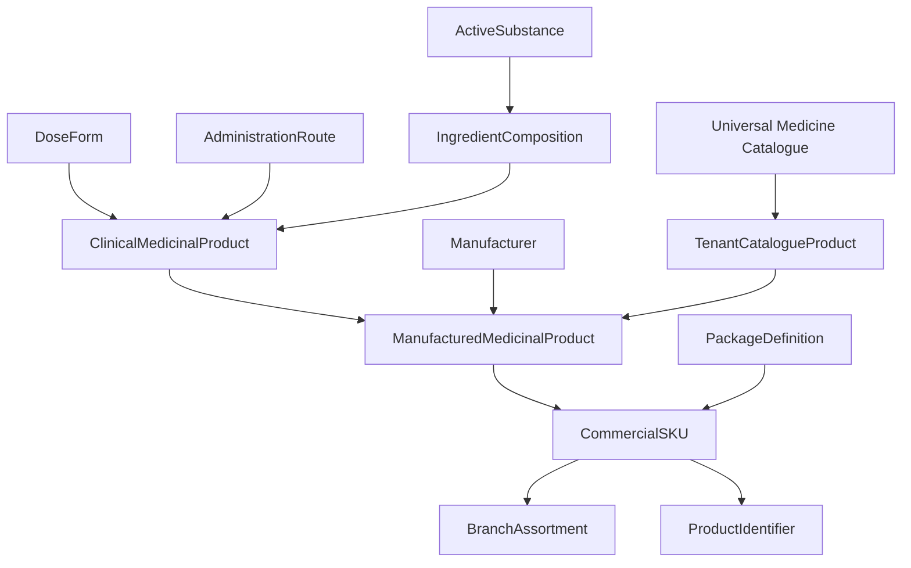

# DawaTrace Enterprise Medicine Catalogue Domain Model

## Executive Summary

The DawaTrace Enterprise Medicine Catalogue separates clinical medicine identity, manufactured product identity, commercial SKU identity, packaging definition, active substances, and branch assortment.

---

## Domain Entity Hierarchy

## Key Entities & Invariants

1. **`ActiveSubstance`**: Canonical active ingredient (e.g., Amoxicillin, Paracetamol).
2. **`IngredientComposition`**: Precise ingredient formulation with explicit decimal strengths and units.
3. **`ClinicalMedicinalProduct`**: Generic formulation (e.g., Paracetamol 500 mg Tablet) referenced by Clinical Decision Support (CDS) and prescription lines.
4. **`ManufacturedMedicinalProduct`**: Branded product (e.g., Panadol 500mg Tablets) produced by a specific Manufacturer.
5. **`PackageDefinition`**: Physical package hierarchy (blister, box, bottle).
6. **`CommercialSKU`**: Sellable/purchasable product unit (e.g., Panadol 500mg 100s Box).
7. **`BranchAssortment`**: Tenant and branch-specific availability rules.
8. **`Medicine` (global)**: Versioned universal reference records imported from authoritative catalogues such as Kenya eTCD.
9. **`TenantCatalogueProduct`**: The explicit, audited selection of a universal medicine into one tenant's catalogue. Selection does not automatically create a sellable SKU; packaging, identifiers, pricing and branch assortment remain tenant-owned governance steps.
