# DawaTrace Drug Interaction and CDS Engine

## Scope and Safety Position

This design covers rules-engine infrastructure, evaluation, findings, governance,
and clinical override evidence. It does not certify any clinical rule content.
No demonstration row, seed rule, or inferred product relationship may be promoted
to production clinical knowledge without an approved source and licence.

The engine supports clinical decision support. It does not replace professional
judgement, prescribing authority, local law, or an approved clinical governance
process.

## Existing Implementation Audit

Mercato currently contains two useful but overlapping CDS implementations.

### Operational Pharmacy DUR

`backend/apps/pharmacy/models.py` and `service.py` implement tenant-scoped:

- `DURRule`, `DURInteractionRule`, `DURDuplicateTherapyRule`, `DURDoseRule` and
  `DURAllergyRule`
- patient allergies and medication profiles
- persisted findings, review queue and pharmacist overrides
- item-pair interactions, allergy, duplicate therapy, dosage, duration,
  early-refill and controlled-medicine checks
- hard-stop enforcement integrated with the live prescription/dispense workflow

This path is operationally valuable, but several rules key on catalogue `Item`
instead of normalized ingredients, severities use `INFO`, `WARNING`, `HARD_STOP`,
and content provenance/versioning is incomplete.

### Phase 7 Clinical Plugin Engine

`backend/apps/prescription/services/cds`, `plugins`, and related models provide:

- normalized `ActiveIngredient` and aliases
- `ClinicalKnowledgeVersion` and source records
- ingredient-pair interactions and models for allergy, dose, renal, hepatic,
  pregnancy and duplicate-therapy knowledge
- plugin contracts, dependency resolution, tenant configuration and findings
- implemented interaction, allergy, contraindication and age evaluators

The data model is broader than the currently executed rule set. Dose, renal,
hepatic, pregnancy/breastfeeding, duplicate therapy, duration, refill and
controlled-drug behavior are not all implemented as equivalent plugin evaluators.
The local provider can return no findings when no active knowledge version exists;
that must become an explicit `KNOWLEDGE_UNAVAILABLE` decision, not an ambiguous
safe result.

### Retention decision

Retain the normalized ingredient/version/plugin infrastructure and the validated
operational enforcement behavior. Consolidate them behind one canonical schema
and one evaluation service. Do not run both engines independently in DawaTrace,
because duplicate or contradictory findings would be clinically unsafe.

## Target Boundary

The `cds` context owns knowledge manifests, executable rules, evaluations,
findings, acknowledgement, override policy and evidence. It reads immutable
clinical facts through query ports and never mutates prescriptions, patients,
stock or payment records directly.

```mermaid
flowchart LR
  TX["Prescription clinical context"] --> NORM["Terminology and ingredient normalization"]
  NORM --> SNAP["Pinned knowledge snapshot"]
  SNAP --> EVAL["Deterministic evaluators"]
  EVAL --> FIND["Explainable findings"]
  FIND --> POLICY["Tenant and statutory enforcement policy"]
  POLICY --> DECISION["PASS, REVIEW, BLOCK or UNAVAILABLE"]
  DECISION --> AUDIT["Immutable evaluation and override evidence"]
```

## Knowledge Model

### Content release

`KnowledgeRelease` is immutable after publication and includes:

- release UUID and semantic/content version
- publisher and clinical source identifiers
- licence identifier and permitted deployment scope
- issue, effective-from, effective-to and imported-at timestamps
- jurisdiction, language and intended population
- source artifact checksums and normalized content checksum
- schema and evaluator compatibility versions
- status: `DRAFT`, `VALIDATED`, `APPROVED`, `ACTIVE`, `SUPERSEDED`, `WITHDRAWN`
- approvers and validation evidence

A tenant activation pins one approved release and optional approved tenant overlay.
An in-flight clinical review stores the exact release and overlay IDs. Activating
a new release never changes historical evaluation results.

### Normalized medicine graph

| Entity | Required identity |
| --- | --- |
| Ingredient | stable code, preferred display, source terminology and version |
| Ingredient alias | normalized alias, language, source and confidence/approval |
| Medicine composition | medicine, ingredient, strength numerator/denominator, unit, role and effective dates |
| Therapeutic class | code system, code, display, hierarchy and version |
| Medicine-class membership | medicine/ingredient, class, source and effective dates |
| Clinical concept | allergy group, condition, route, dosage form, age band or organ-function category with terminology binding |

Free-text matching can assist data quality review but cannot create a production
blocking finding. Unresolved or ambiguous ingredient mapping produces an explicit
normalization warning and may block according to policy.

## Rule Families

All rule records share rule UUID, release, type, version, effective interval,
jurisdiction, source citation, evidence grade, severity, enforcement, explanation
template, recommendation, activation state and test-vector references.

| Rule family | Minimum inputs | Evaluation result |
| --- | --- | --- |
| Ingredient interaction pair | normalized ingredient A/B, route if relevant | interaction severity and recommendation |
| Class interaction | class A/B membership | class-level interaction with matched members |
| Allergy/cross-sensitivity | patient allergy code/group and ingredient/class | allergy finding with matched allergy provenance |
| Duplicate therapy | current plus proposed ingredients/classes and active date window | overlapping therapy finding |
| Condition contraindication | active condition and ingredient/class | contraindication or precaution |
| Age restriction | age at review and medicine/ingredient | age-range violation or warning |
| Pregnancy/breastfeeding | recorded status/stage and ingredient/class | pregnancy/lactation finding |
| Renal | renal measure/category, date and dose | adjustment, maximum or avoid recommendation |
| Hepatic | hepatic category/date and dose | adjustment, maximum or avoid recommendation |
| Dose | amount, unit, route, frequency, weight/body surface where required | per-dose or interval limit finding |
| Maximum daily dose | normalized total exposure across lines and active medicines | daily-limit finding |
| Duration | start/end or prescribed duration | duration-limit finding |
| Early refill | prior dispenses, authorized quantity and days supplied | refill-window finding |
| Controlled medicine | schedule, prescriber/patient/quantity and policy facts | verification or statutory block |

Unit conversion must use a versioned, testable terminology service. If required
weight, organ function, pregnancy status, unit conversion, composition, or source
data is unavailable, the evaluator returns an incomplete-data finding rather than
silently concluding that no risk exists.

## Tenant Awareness

Clinical source content is either explicitly global and licensed or tenant-owned.
Null tenant is never interpreted as global. Tenant overlays may:

- tighten enforcement
- add locally approved rules and formulary guidance
- configure review routing within limits
- deactivate an advisory local rule with reason and approval

Tenant overlays cannot weaken statutory controls, remove a globally mandated
contraindication, alter licensed source content, or change historical results.
Every query includes tenant, active release, effective timestamp and jurisdiction.

## Evaluation Contract

`evaluateClinicalContext(command)` receives:

- tenant, facility and requesting user/device
- patient identity and version
- age/date of birth and relevant physiology
- active allergies, conditions, observations and pregnancy/lactation status with
  provenance and recorded/effective dates
- active medication and prior dispense exposure
- prescription lines with normalized ingredient, dose, route, frequency and duration
- controlled schedule and prescriber verification facts
- requested evaluation time and idempotency key

The service calculates a canonical input hash, selects the pinned release, runs
deterministic evaluators, applies policy, persists the evaluation/finding set and
returns the existing result on an identical retry. A changed input creates a new
evaluation and invalidates approval derived from the old hash.

## Finding Contract

Every finding contains:

- finding UUID, evaluation UUID, tenant and transaction/prescription reference
- rule UUID, rule version, knowledge release and source attribution
- severity and enforcement action
- affected patient facts and line/ingredient/class references
- concise title, explainable clinical reason and recommendation
- matched values, thresholds, units and effective date
- data completeness state
- created timestamp and evaluator version
- status: `OPEN`, `ACKNOWLEDGED`, `OVERRIDDEN`, `RESOLVED`, `SUPERSEDED`
- acknowledgement/override actor, capability, reason, approval evidence and time

The explanation must be reconstructable without executing the current rule code.
PHI is not copied into general telemetry or external event payloads.

## Severity and Enforcement

| Severity | Default action | Minimum operator | Override policy |
| --- | --- | --- | --- |
| `INFORMATIONAL` | display and include in review record | trained operator | acknowledgement optional by tenant policy |
| `MINOR` | display; acknowledgement may be required | trained operator or pharmacist per policy | reason optional only if policy explicitly allows |
| `MODERATE` | hold clinical approval for pharmacist review | pharmacist | capability plus reason; audit mandatory |
| `MAJOR` | block until pharmacist/authorized prescriber intervention | senior pharmacist/authorized clinical role | explicit capability, reason and fresh approval; policy may prohibit |
| `CONTRAINDICATED` | hard block | pharmacist sees result | no ordinary override; only a separately approved statutory/clinical escalation path may exist |

`KNOWLEDGE_UNAVAILABLE`, stale patient context, ambiguous medicine mapping and
evaluator failure are decision states independent of severity. Prescription
dispensing fails closed when a required clinical check cannot be completed.

## Override Controls

An override is a command against one open finding and evaluation version. It
requires an allowed policy, capability, authenticated actor, non-empty reason,
optional second factor/supervisor evidence, patient/prescription context hash,
timestamp and device. It never edits or deletes the finding. Expiry, scope, and
material changes invalidate the override.

Cashiers do not receive major, contraindicated, controlled, or clinical override
capabilities by default. A UI-hidden action remains server-protected.

## Plugin Safety

Plugins run through an allowlisted registry with signed manifest, version,
publisher, required permissions, compatible knowledge schema, deterministic test
vectors, timeout and resource limits. Production activation requires clinical,
security and licensing approval. Dynamic arbitrary Python installation is outside
the initial product boundary.

Provider adapters return typed normalized facts. They cannot execute tenant ORM
queries without tenant context, mutate domain state, initiate network calls during
an evaluation, or downgrade an unavailable result to an empty list.

## Content Environments

| Environment | Permitted content |
| --- | --- |
| Unit/CI | synthetic fixtures with no clinical claim |
| Demo | visibly labelled demonstration rules, isolated from production tenants |
| Staging validation | candidate licensed package with non-production access controls |
| Production | licensed, approved, signed and effective-dated releases only |

Seed commands must default to demo scope and refuse a production environment
unless an explicit, audited content-import procedure is used.

## Validation Strategy

Each rule ships positive, negative, boundary, unit-conversion, chronology and
missing-data vectors. The engine suite also proves:

1. deterministic output for the same input/release
2. tenant isolation and explicit global content behavior
3. effective-date and activation boundaries
4. ingredient alias and class normalization
5. symmetric pair handling without duplicate findings
6. severity/policy mapping and prohibited overrides
7. input change invalidates review and override evidence
8. unavailable knowledge/evaluator failure cannot return a false pass
9. concurrent/idempotent evaluation and override commands
10. full provenance and historical replay after release supersession

Clinical validation compares expected findings against an approved reference set,
with sensitivity/specificity and false-positive review defined by clinical owners.
Engineering tests alone do not certify clinical correctness.

## Extraction Sequence

1. Freeze and characterize both current engines with compatibility fixtures.
2. Establish canonical ingredient, release, finding and severity contracts.
3. Port the Phase 7 normalized model/plugin infrastructure without changing its
   validated FHIR-facing behavior.
4. Adapt operational Pharmacy DUR checks into typed evaluators one family at a time.
5. Compare dual evaluation in shadow mode; do not expose duplicate findings.
6. Obtain clinical and licensing approval for the production knowledge pipeline.
7. Switch prescription review to the canonical engine only after parity gates.
8. Retain the old path read-only for rollback until reconciled cutover acceptance.

## Known Gaps Before Production Certification

- The canonical merge between item-based DUR and ingredient-based CDS is undecided.
- Not every modeled rule family has an executed evaluator today.
- Missing active knowledge currently has fail-open ambiguity in one path.
- Production interaction content provider and licence are not approved.
- Clinical validation thresholds and accountable clinical governance roles are
  not recorded in the repository.

These gaps block a claim that DawaTrace has a production-certified comprehensive
interaction database. They do not invalidate the retained, tested engine
infrastructure or the Phase 1 extraction design.
