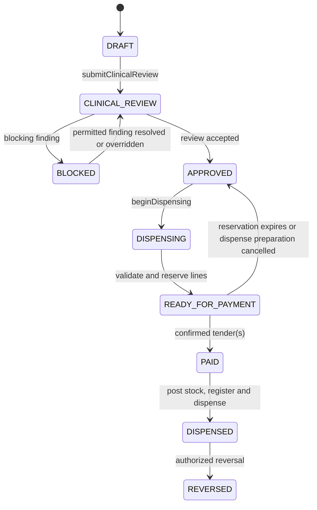

# DawaTrace Pharmacy POS Architecture

## Purpose

This document defines the standalone Windows and Android Pharmacy POS boundary.
It preserves the validated Mercato pharmacy behavior while removing assumptions
that Pharmacy is a mode inside a general Retail client.

The backend remains authoritative for prescription state, clinical decisions,
batch eligibility, controlled-drug controls, stock posting, payment confirmation,
and reversal. A POS client is an offline-capable command client and local read
model, not an alternative system of record.

## Current Source Assessment

| Source | Behavior to retain | Isolation work required |
| --- | --- | --- |
| `apps/pos-windows/src/App.tsx` and pharmacy helpers | Pharmacy queue, patient/prescriber/prescription operations, DUR review, per-line batch selection, FEFO default, override reasons, label/receipt output and settlement | Extract from the multi-mode application and split the 16,000-plus-line shell into pharmacy workflows |
| `apps/pos-android/src/screens/PharmacyPosWorkspace.tsx` | Mobile queue, DUR, approval, per-line batch choice, FEFO reason capture, labels and payment-linked dispensing | Remove Retail navigation and package identity; align offline policy with Windows |
| `apps/pos-android/src/pharmacyPos.ts` | Pharmacy API normalization and queue/status mapping | Move to a typed DawaTrace pharmacy client package |
| `apps/pos-android/src/offline/pharmacyBatchResolver.ts` | Trusted-cache checks, FEFO ordering and pending local deduction awareness | Retain only after the prescription offline policy and cache signatures are certified |
| `packages/shared/src/api.ts` | Existing pharmacy endpoints and authentication client | Split the pharmacy contract from the broad Mercato API client |
| `packages/shared/src/offline.ts` and POS persistence | Local catalogue, queue and outbox primitives | Version and scope data by tenant, store, device and contract version |

The current Windows client blocks queued offline Pharmacy sales, while shared and
Android code contains offline batch resolution and deduction behavior. That is a
policy mismatch, not evidence that offline prescription dispensing is certified.
DawaTrace must use the fail-closed policy below until an explicit offline clinical
approval design passes safety and reconciliation tests.

## Deployment Shape

Both clients consume the same versioned DawaTrace contracts:

```text
packages/contracts
  pharmacy-api
  clinical-findings
  dispense-commands
  payment-commands
  sync-events
  printer-jobs
packages/pos-core
  state-machine
  capabilities
  local-store
  outbox
  reconciliation
apps/pos-windows
apps/pos-android
```

Platform-specific packages own presentation, secure storage, scanner/keyboard
input, printing, card/fingerprint peripherals, and release signing. They do not
fork clinical, FEFO, tender, or synchronization rules.

## Aggregate and State Machine

The checkout unit is a `PharmacyTransaction`. It owns references to patient,
prescription, review, dispense preparation, payment, and reversal evidence. Its
state is controlled by backend commands with optimistic concurrency.



### Transition invariants

| From | Command | Required evidence | Result or rejection |
| --- | --- | --- | --- |
| `DRAFT` | submit clinical review | tenant, store, patient when required, prescription lines, prescriber for prescription sale | `CLINICAL_REVIEW`; malformed or cross-tenant references rejected |
| `CLINICAL_REVIEW` | complete review | pinned knowledge version, findings, actor and review timestamp | `BLOCKED` if unresolved blocking findings, otherwise `APPROVED` |
| `BLOCKED` | resolve/override finding | capability, permitted severity, reason, fresh approval where policy requires | returns to review; contraindicated rules remain blocked unless an approved policy explicitly permits escalation |
| `APPROVED` | begin dispensing | unexpired approval and unchanged line/clinical fingerprint | `DISPENSING`; material edits invalidate review |
| `DISPENSING` | prepare dispense | valid batches, FEFO decision, quantities, controlled checks and label data | `READY_FOR_PAYMENT`; expired, recalled, quarantined or insufficient batches rejected |
| `READY_FOR_PAYMENT` | confirm tender | provider or cash evidence, balanced split tenders and idempotency key | `PAID`; no inferred M-Pesa/card confirmation |
| `PAID` | finalize dispense | payment reference, inventory reservation, source version | `DISPENSED` atomically or a recoverable posting state with no duplicate issue |
| `DISPENSED` | reverse | authorized actor, reason, original references and return/disposition decision | `REVERSED`; append-only correction facts created |

No prescription transaction can move from item selection or `DRAFT` directly to
payment. The server rejects skipped, stale, replayed, or out-of-order commands.

## OTC and Prescription Routing

1. Item lookup returns explicit sale controls, not a UI-inferred item type.
2. Ordinary OTC items may enter a lightweight DawaTrace sale flow, but controlled,
   prescription-only, recalled, quarantined or expired stock cannot use it.
3. Any item requiring prescription, clinical review, controlled verification or
   pharmacist authorization creates or joins a `PharmacyTransaction` in `DRAFT`.
4. Mixed carts are either represented by one clinically governed transaction or
   split explicitly. They must never hide prescription lines in a retail tender.
5. Price, discount and tax calculations are server-revalidated before payment.

## Workstation Layout

The primary surface has stable regions so the on-screen keyboard cannot obscure
the cart or clinical decisions:

- compact patient and prescription header
- searchable medicine/item lookup with scanner focus
- line list containing item ID, description, batch, quantity, unit price,
  discount and line total
- persistent transaction total and state
- contextual clinical review or dispensing panel
- fixed command bar with only actions valid for the current state

Patient registration, prescriber capture, clinical finding resolution, batch
selection, tender, label preview, receipt preview, cash management and reversal
use focused dialogs. A dialog does not nest another full workspace. Destructive
or privileged actions state the consequence and require reason/approval evidence.

## Clinical Review in POS

The POS submits a clinical context fingerprint covering patient, allergies,
conditions, active medicines, prescription lines, dose, route, duration and the
knowledge version. The response includes findings with stable rule IDs,
severity, explanation, evidence/source, enforcement, and permitted actions.

- Informational and minor findings may acknowledge according to tenant policy.
- Moderate and major findings require pharmacist review; override requires an
  explicit capability and non-empty reason.
- Contraindicated findings fail closed. Any exceptional escalation must be a
  separately approved, time-bound policy and never a cashier capability.
- Changing a clinically material field invalidates the review and clears approval.
- Offline cached findings do not become authority merely because they are visible.

## Batch and FEFO Handling

Each prescription line receives its own candidate list. Candidate records include
batch ID/number, expiry, available quantity, status, block reason, near-expiry
flag, FEFO rank and a server-issued projection version.

The earliest valid expiry is selected by default. Choosing another valid batch is
a FEFO override and requires `pharmacy.override_fefo`, a reason, suggested batch,
selected batch, actor, time and transaction reference. Expired, recalled or
quarantined stock is never an override candidate. Multi-line requests carry a
line ID and batch ID per line, preventing one selection from leaking to another.

## Controlled Medicines

Controlled items require the configured identity and approval policy before
dispense preparation. The backend creates immutable receipt, dispense, return,
write-off and reversal register facts with running-balance evidence where
supported. Cashiers cannot approve controlled actions unless explicitly assigned
the capability. Peripheral fingerprint or magnetic-card assertions are submitted
as signed approval evidence; they are not stored as reusable supervisor secrets.

## Tender and Finalization

Tender order in both clients is Cash, M-Pesa, Card, Wallet, then configured
alternatives. The tender modal owns:

- amount due, amount tendered and remaining amount
- split-tender allocation
- cash received and change, with expected drawer values hidden from customers
- external provider initiation and confirmed transaction evidence
- retry-safe idempotency and a visible recoverable status

Payment confirmation does not itself decrement stock. Finalization is one backend
orchestration that verifies the clinical fingerprint and reservation, creates the
dispense, posts stock/controlled facts, links payment and emits outbox events. A
retry returns the original result. Partial failure cannot create a second sale or
second stock issue.

## Offline Policy

### Certified initial policy

- Catalogue search and an in-progress draft may be available offline from a
  signed, tenant/store/device-scoped cache.
- Ordinary, eligible OTC sales may queue only under the approved generic offline
  policy and trusted stock horizon.
- New prescription clinical review, DUR override, controlled dispense, payment
  provider confirmation, and final prescription dispense fail closed offline.
- A previously server-approved transaction may not be dispensed offline in Phase
  1 unless a later certification defines lease expiry, stock reservation,
  revocation, controlled-register sequencing and reconciliation.
- The UI identifies offline state before item selection and gives a recovery path.

### Sync protocol

Every queued command carries tenant, store, device, local sequence, aggregate ID,
expected server version, schema version, idempotency key, occurred-at time and
payload hash. The server processes in tenant/device sequence, returns an immutable
acknowledgement, and exposes conflicts for operator resolution. The client never
silently overwrites server state or rewrites a completed local record.

## Authentication, Authorization and Device Trust

- Access tokens are short-lived; refresh tokens use secure platform storage.
- Tenant, store, register and device provisioning are independently validated.
- Capabilities come from a server-signed session projection and are rechecked by
  every privileged API command.
- Offline capability leases have an expiry and cannot authorize clinical or
  controlled actions under the initial policy.
- Logout clears PHI and credentials according to retention policy while retaining
  encrypted, acknowledged audit metadata needed for reconciliation.

## Printing

Labels are generated from committed dispense truth and include medicine, patient,
directions, quantity, batch/expiry where policy requires, prescription, pharmacy
and pharmacist data. Reprints create an audit event with actor and reason.
Receipts use the committed sale/tender and linked dispense references. Tax QR or
provider evidence appears only when returned by the authoritative integration.
Failed printing does not repeat payment or dispensing.

## Observability and Support

Record correlation IDs across transaction, prescription, review, dispense,
payment, stock, finance and print jobs. Telemetry may include state, duration,
error code and contract version, but not patient names, prescription narratives,
tokens, payment secrets or raw clinical payloads.

## Acceptance Gates

The extracted POS is not releasable until both clients prove:

1. The full state machine rejects skipped transitions and stale review evidence.
2. Item lookup searches the DawaTrace catalogue beyond any fixed first page.
3. Per-line FEFO selection and override audit work for multi-line prescriptions.
4. Blocked batches and unresolved findings cannot reach tender.
5. Controlled actions enforce capabilities and produce register facts.
6. Split tender, retries, refunds and reversals remain idempotent.
7. Stock, dispense, payment, finance and receipt references reconcile.
8. Offline behavior matches one documented policy and fails closed otherwise.
9. Tenant/store/device isolation and local encryption tests pass.
10. Windows installer and Android package are signed, reproducible, scanned and
    built from the same approved contract version.

## Phase 1 Decision

Retain the existing pharmacy workflows and focused tests, but do not copy the
multi-mode clients wholesale as the DawaTrace implementation. Phase 2 extracts
pharmacy helpers and screens behind contracts, establishes the state-machine
package, and leaves Mercato clients intact until parity and rollback gates pass.
