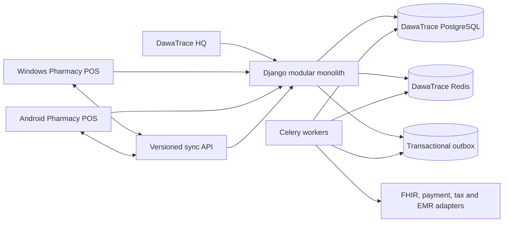

# DawaTrace Product Architecture

## Status

- Phase: 1, extraction foundation
- Architecture style: modular monolith with independently packaged POS clients
- Source baseline: Mercato-OS `5c84ad1781d843654b4bc446466384fee18394f1`
- FHIR runtime lock: `fhir.resources==6.5.0`, `pydantic==1.10.26`
- Deployment status: design only; no DawaTrace deployment or production data change

## Product Boundary

DawaTrace is the system of record for pharmacy, medication, patient, clinical,
dispensing, pharmacy inventory, procurement, controlled-drug, finance, payment,
reporting, and interoperability data. It is not a Mercato mode or a thin client
over Mercato APIs. It must build, test, migrate, deploy, license, and certify from
its own repository and database.

DawaTrace excludes Restaurant, general Retail, Wholesale, Forecourt, Factory,
loyalty, and unrelated ecommerce behavior. Reusable implementation may be
forked into DawaTrace-owned packages, but the running product must not load code,
migrations, tables, or configuration from those excluded domains.

## Architectural Principles

1. Preserve validated pharmacy and FHIR behavior before changing model shape.
2. Keep one deployable backend until measured operational need justifies a split.
3. Enforce tenant scope at manager, service, API, reference, event, and task layers.
4. Make every cross-context write pass through an application service or contract.
5. Keep journals, stock ledgers, controlled-drug records, clinical audit, and FHIR
   idempotency append-only or reversal-based where their domain requires it.
6. Separate executable rule infrastructure from demonstration and licensed
   clinical content.
7. Use an independent PostgreSQL database, Redis namespace, object store prefix,
   signing keys, domains, package IDs, release channels, and build provenance.
8. Treat POS synchronization as a protocol with versioned commands and events,
   not as shared database access.

## Bounded Contexts

| Context | Responsibilities | Owns | May depend on |
| --- | --- | --- | --- |
| `platform` | Settings, health, observability, feature flags, idempotency primitives | Runtime configuration and operational metadata | None |
| `tenancy` | Tenant boundary and routing | Tenant and tenant context | `platform` |
| `identity` | Authentication, users, roles, capabilities, approvals | Users, roles, sessions, overrides | `platform`, `tenancy`, `audit` |
| `organizations` | Pharmacy organizations, facilities, stores, registers, devices | Facility, store, register, device | `tenancy`, `identity` |
| `medicines` | National medicine identity, ingredients, aliases, barcodes, regulatory metadata | Canonical medicine and ingredient identities | `platform`, `terminology`, `audit` |
| `catalogue` | Tenant and store activation, price, UOM, sale controls | TenantMedicine, StoreMedicine, pharmacy sale item | `medicines`, `organizations`, `suppliers` |
| `patients` | Patient demographics, identifiers, consent, allergies, medication profile | Patient clinical identity | `tenancy`, `audit` |
| `practitioners` | Practitioner, prescriber, licence, specialty, role | Practitioner identity and credentials | `organizations`, `audit` |
| `prescriptions` | Prescription order, lines, status, verification and refill authorization | Canonical prescription aggregate | `patients`, `practitioners`, `medicines`, `clinical` |
| `dispensing` | Clinical handoff, allocation, labels, dispense and reversal | Dispense aggregate and label events | `prescriptions`, `batches`, `controlled_drugs`, `payments` |
| `clinical` | Encounters, conditions, observations, reports, documents, administrations | Tenant-owned clinical records | `patients`, `practitioners`, `organizations`, `audit` |
| `cds` | Rule evaluation, findings, policies, overrides and evidence | Versioned rules and evaluations | `medicines`, `patients`, `clinical`, `prescriptions` |
| `fhir` | R4 REST interactions, Bundle, OperationOutcome, references, converters | FHIR identities and idempotency | Domain command/query ports, `terminology`, `audit` |
| `terminology` | CodeSystem, ValueSet, versions, `$validate-code`, `$expand` | Global or tenant terminology artifacts | `platform`, `audit` |
| `inventory` | Stock ledger, balances, locations, bins, stock take, transfer | Inventory events and projections | `catalogue`, `organizations`, `audit` |
| `batches` | Batch identity, expiry, FEFO, quarantine and release | Batch state and allocation audit | `inventory`, `suppliers`, `quality` |
| `procurement` | PO, approval, receipt and discrepancy workflow | Purchase documents and GRNs | `suppliers`, `catalogue`, `inventory`, `finance` |
| `suppliers` | Supplier master, medicine links, terms, performance | Supplier and supplier-item relationship | `tenancy`, `audit` |
| `controlled_drugs` | Receipt, dispense, return, write-off register | Controlled-drug events and balances | `dispensing`, `batches`, `identity`, `audit` |
| `quality` | Quarantine, release, return disposition and write-off approval | Quality holds and disposition decisions | `batches`, `identity`, `audit` |
| `recalls` | Recall scope, affected batches, block and explicit release | Recall aggregates | `medicines`, `batches`, `suppliers`, `quality` |
| `finance` | Account mappings, journals, COGS, settlement and reconciliation | Pharmacy financial ledger | `dispensing`, `inventory`, `procurement`, `payments`, `audit` |
| `payments` | Tender configuration, intent, provider confirmation, refund | Payment evidence and reconciliation | `organizations`, `identity`, `audit` |
| `reporting` | Pharmacy operational and statutory read models | Report definitions and exports | Read-only context projections |
| `notifications` | In-app, email and integration notifications | Delivery attempts and status | `workflows`, `identity` |
| `workflows` | Durable outbox, retries, scheduled jobs and approvals | Workflow execution state | Domain events, `audit` |
| `audit` | Tamper-evident actor and change records | Audit records | `tenancy`, `identity` identifiers only |
| `integrations` | EMR, SHA/DHA, accounting, tax and payment adapters | Adapter config and delivery state | Versioned domain contracts |
| `pos` | Windows pharmacy workstation | Local cache, outbox, device state | Versioned API/sync contracts |
| `mobile` | Android pharmacy workstation | Local cache, outbox, device state | Versioned API/sync contracts |

## Dependency Rules

- Domain models must not import UI, transport, Celery, or provider adapters.
- FHIR converters call domain command/query ports; domain models do not depend on
  FHIR resource classes or HTTP semantics.
- `dispensing` may request stock allocation and payment preparation but cannot
  write inventory, finance, or payment tables directly.
- `finance` consumes immutable source facts and returns posting references. It
  must not mutate prescriptions, dispenses, or inventory.
- POS clients use public contracts only. They never depend on Django model shape.
- Cross-context events carry tenant, aggregate, version, idempotency key, actor,
  occurred-at, schema version, and correlation identifiers.
- No DawaTrace module imports Restaurant, Retail, Wholesale, Forecourt, Factory,
  OMS, or loyalty code.

## Target Repository Shape

```text
dawatrace/
  apps/
    hq/
    pos-windows/
    pos-android/
  backend/
    config/
    dawatrace/
      platform/
      tenancy/
      identity/
      organizations/
      medicines/
      catalogue/
      patients/
      practitioners/
      prescriptions/
      dispensing/
      clinical/
      cds/
      fhir/
      terminology/
      inventory/
      batches/
      procurement/
      suppliers/
      controlled_drugs/
      quality/
      recalls/
      finance/
      payments/
      reporting/
      notifications/
      workflows/
      audit/
      integrations/
  packages/
    contracts/
    pharmacy-domain/
    pos-core/
    ui/
    brand/
  infra/
    compose/
    fhir-certification/
  scripts/
  tests/
  docs/
```

The package names above are target boundaries, not instructions to rewrite the
validated implementation immediately. Phase 2 first copies behavior and tests,
then moves code behind these boundaries in small, test-gated changes.

## Runtime Topology



Initial deployment units are backend, Celery worker, Celery beat, HQ, PostgreSQL,
Redis, and independently signed Windows/Android packages. These are operational
processes around one modular backend, not microservices.

## Canonical Transaction Flow

1. Operator selects or registers a patient and captures prescription/prescriber.
2. Prescription command validates tenant, required fields, licence and item links.
3. CDS evaluates medication, patient and clinical context against a pinned rule set.
4. A pharmacist resolves warnings and permitted overrides with reason and identity.
5. Dispensing requests FEFO allocation from the batch context.
6. Controlled medicines create required register facts and approval evidence.
7. The dispense becomes `READY_FOR_PAYMENT`; no clinical command is embedded in
   the tender operation.
8. Payment confirmation creates an immutable sale/payment source fact.
9. Inventory and finance post idempotently and return their ledger references.
10. Receipt, labels, audit records, FHIR views and reports read the same committed
    aggregate identifiers.

## Contract Baseline

Minimum event contracts are:

- `PrescriptionCaptured.v1`
- `ClinicalReviewCompleted.v1`
- `ClinicalOverrideRecorded.v1`
- `DispensePrepared.v1`
- `DispensePaid.v1`
- `DispenseReversed.v1`
- `StockReceived.v1`
- `BatchAllocated.v1`
- `StockIssued.v1`
- `StockReturnedToQuarantine.v1`
- `ControlledDrugEventRecorded.v1`
- `PaymentConfirmed.v1`
- `PaymentReversed.v1`
- `FinancePostingCompleted.v1`

Contracts must be defined in `packages/contracts` using JSON Schema or equivalent,
with compatibility tests in backend and both clients. Existing Mercato event names
are migration inputs, not permanent DawaTrace contracts.

## Tenancy and Security

- Every tenant-owned row has an explicit non-null tenant foreign key.
- Default managers fail closed without an active tenant context.
- UUID lookup alone is prohibited for tenant-owned records.
- Database uniqueness includes tenant unless the artifact is explicitly global.
- Global clinical or terminology content has explicit `is_global`, provenance,
  licence, version and publication controls; it is never inferred from a null tenant.
- PHI is excluded from logs, event diagnostics and idempotency error messages.
- High-risk actions require capability checks, fresh approval where configured,
  actor identity, reason, timestamp and device.
- FHIR writes remain disabled by default and use resource-specific capabilities.

## FHIR Boundary

DawaTrace preserves the measured HL7 FHIR R4 4.0.1 surface and the exact runtime
pins. The FHIR API is an anti-corruption layer over DawaTrace domain services. It
must preserve Bundle transaction atomicity, batch independence, OperationOutcome,
tenant-qualified references, terminology operations and idempotency behavior.

The current evidence permits a measured HAPI R4 claim only. DawaTrace must not be
described as `FHIR_PORTABLE` until Firely and all remaining portability gates pass.

## Key Architecture Decisions Still Open

1. Select the canonical prescription aggregate between `apps.pharmacy` and
   `apps.prescription`, with an explicit ID and status migration map.
2. Select the canonical patient/practitioner identity model and deduplication rules.
3. Decide whether national medicine and terminology masters are DawaTrace-owned
   global data or licensed feeds managed by a separate content service.
4. Decide whether existing Mercato identities are copied, federated through OIDC,
   or both during transition.
5. Approve the legacy customer cutover pattern: one-time cutover, coexistence with
   event replication, or tenant-by-tenant migration.
6. Approve clinical content providers and licence terms before production rule load.

## Architecture Gate

The target architecture is viable as a modular monolith. Extraction cannot begin
by copying the four healthcare folders alone. Phase 2 may start only after the six
decisions above have named owners and acceptance criteria, and after intended
source is placed in a clean tracked release branch.
